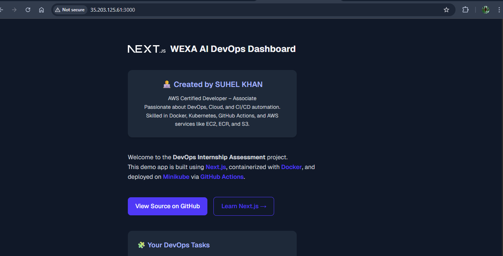
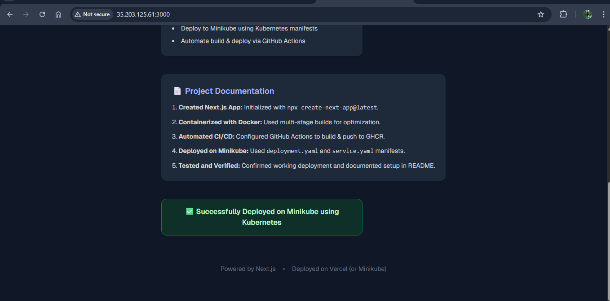

🚀 Next.js DevOps Internship Assessment

A complete DevOps assessment project demonstrating CI/CD automation, Docker containerization, and Kubernetes deployment using Minikube and GitHub Actions.

🌐 Live Preview

Application successfully deployed and accessible at:
👉 http://35.203.125.61:3000

## 🖼️ Screenshots

| Homepage | Deployment Status |
|-----------|-------------------|
|  |  |

👨‍💻 Created by

🧑‍💻 SUHEL KHAN
AWS Certified Developer – Associate
💡 Passionate about DevOps, Cloud, and CI/CD Automation
🔧 Skilled in Docker, Kubernetes, GitHub Actions, and AWS (EC2, ECR, S3)

📁 Project Overview

This project automates the complete DevOps workflow:

✅ Built with Next.js

🐳 Containerized using Docker

⚙️ Automated CI/CD with GitHub Actions

📦 Published Image to GitHub Container Registry (GHCR)

☸️ Deployed on Minikube using Kubernetes manifests

🏗️ Folder Structure
Assignment/
│
├── devops_intern/
│   ├── Dockerfile
│   ├── k8s/
│   │   ├── deployment.yaml
│   │   └── service.yaml
│   ├── .github/
│   │   └── workflows/
│   │       └── ci-cd.yml
│   ├── images/
│   │   ├── Screenshot_1.png
│   │   └── Screenshot_2.png
│   ├── README.md
│   └── nextjs-app/        # Next.js source code

⚙️ Setup Instructions
1️⃣ Clone Repository
git clone https://github.com/SUHEL782/Assignment.git
cd Assignment/devops_intern

2️⃣ Build Docker Image Locally
docker build -t nextjs-app:latest .

3️⃣ Run Locally
docker run -p 3000:3000 nextjs-app:latest

Access the app at 👉 http://localhost:3000

☸️ Deployment on Minikube
1️⃣ Start Minikube
minikube start

2️⃣ Apply Kubernetes Manifests
kubectl apply -f k8s/deployment.yaml
kubectl apply -f k8s/service.yaml

3️⃣ Access the Application
minikube service nextjs-app-service

🧰 CI/CD Automation (GitHub Actions)

The GitHub Actions workflow (.github/workflows/ci-cd.yml) automates:

🏗️ Building Docker image

🚀 Pushing image to GitHub Container Registry (GHCR)

🔖 Tagging image with version and commit hash

☸️ Deploying to Minikube / Kubernetes

🐳 GHCR Image

Image URL:
ghcr.io/suhel782/assignment/nextjs-app:latest

You can pull it using:

docker pull ghcr.io/suhel782/assignment/nextjs-app:latest

📜 Project Documentation Summary

Created Next.js app using npx create-next-app@latest

Containerized with optimized multi-stage Docker build

Automated CI/CD with GitHub Actions → GHCR

Deployed on Minikube using Kubernetes YAMLs (deployment.yaml, service.yaml)

Verified live deployment at http://35.203.125.61:3000

✅ Final Output

🟢 Successfully deployed on Minikube using Kubernetes
📎 Repository: GitHub - SUHEL782/Assignment
